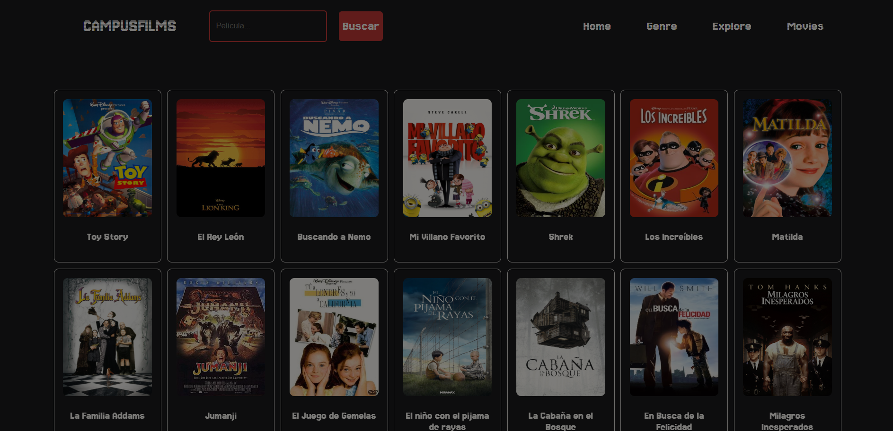
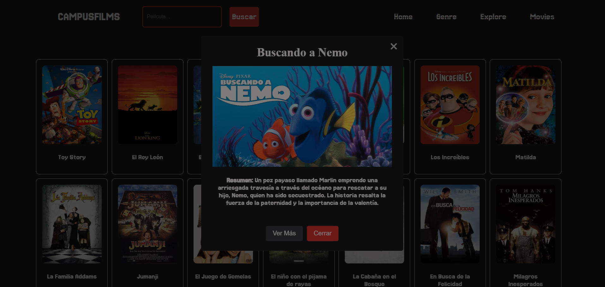
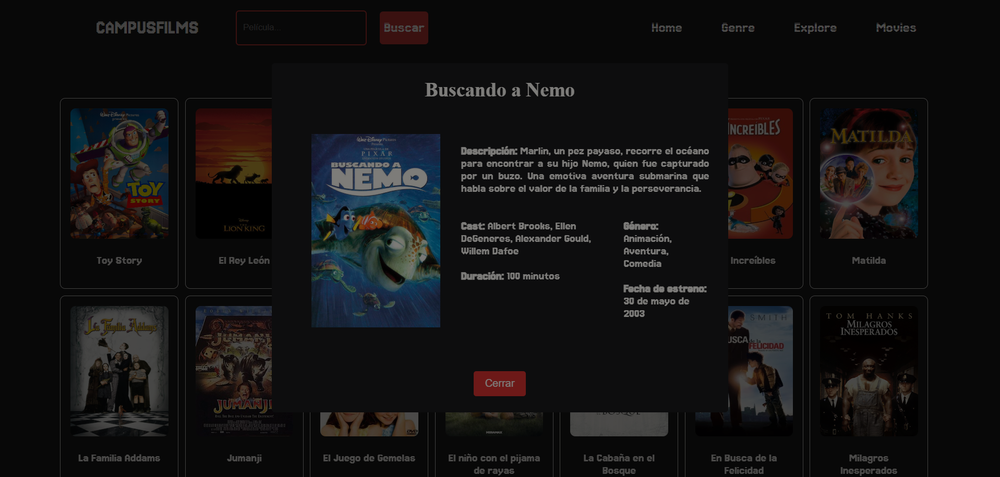

# CAMPUSFILMS-Actividad
https://merliariza.github.io/actividad-peliculas/

Campusfilms es una aplicación web interactiva para buscar, ver detalles y mostrar información adicional de películas. Utiliza funcionalidades asincrónicas para mejorar la experiencia del usuario, mostrando pop-ups dinámicos con información sobre las películas.

## Descripción

El usuario puede buscar películas a través de una barra de búsqueda. Al ingresar texto en la barra de búsqueda, la página filtrará las películas que coincidan con el término ingresado, mostrando solo las películas que coincidad con la busqueda. Cuando se hace clic en una tarjeta de película, se muestran dos pop-ups consecutivos con detalles e información adicional sobre la película seleccionada.

### Características principales

- **Búsqueda de películas**: La barra de búsqueda filtra las tarjetas de películas a medida que el usuario escribe.
- **Pop-ups informativos**: Al hacer clic en una tarjeta de película, se muestran dos pop-ups con información detallada sobre la película seleccionada.
- **Diseño responsivo**: La aplicación está diseñada para ser completamente funcional en dispositivos de diferentes tamaños.

## Tecnologías utilizadas

- **JavaScript**: Para la funcionalidad dinámica, asincrónica y manejo de eventos.
- **Promesas y asincronía**: Usadas para manejar la carga de pop-ups de manera asincrónica sin bloquear el flujo de la aplicación.
- **HTML & CSS**: Para la estructura y estilo de la aplicación, con un enfoque en la adaptabilidad y la experiencia de usuario.

## Funcionalidad del Código

### 1. Barra de búsqueda de películas

La función `handleSearch` permite al usuario buscar películas a través de una barra de búsqueda. A medida que el usuario escribe, se filtran las películas que contienen el texto ingresado en su título. Si no se encuentran resultados, se muestra un mensaje indicando que no se encontraron películas.

### 2. Pop-ups de película

Cuando un usuario hace clic en una tarjeta de película, se muestra un primer pop-up con información básica, seguido de un segundo pop-up que contiene detalles adicionales como el cast, la duración, el género y la fecha de estreno. Ambos pop-ups son asincrónicos y se manejan mediante promesas.

- **`showFirstPopup`**: Muestra un pop-up con información básica de la película.
- **`showSecondPopup`**: Muestra un pop-up con información detallada adicional.

### 3. Uso de promesas

Las funciones `showFirstPopup` y `showSecondPopup` están implementadas utilizando promesas y `async/await`, lo que permite que la aplicación muestre los pop-ups sin bloquear el flujo del código. Si el usuario cierra el pop-up, se captura el evento y se maneja adecuadamente.
